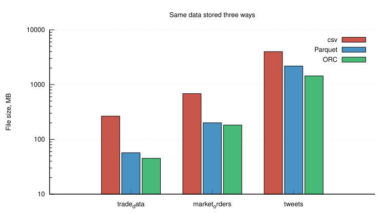
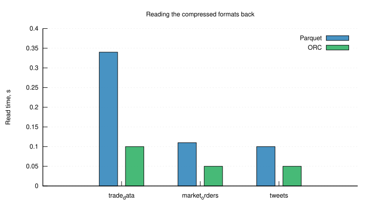

# Columnar formats against csv

Row formats store a table the way it is written, one record after another. Columnar formats
turn it on its side and keep each column together, which lets a reader touch only the
columns a query asks for and lets an encoder compress values that are alike because they
mean the same thing. This study measures what that is worth on real data, and whether the
two dominant formats differ enough to matter.

## Method

Three datasets of deliberately different shape are used, a table of trades, a table of market
orders, and a corpus of tweets that is mostly free text. Each is read from csv with Spark,
given an extra computed column holding the summed length of all fields, and written out in
both Parquet and ORC. The written files are then read back, with the Spark cache cleared
between runs so that the timings measure the format and not the memory that happens to hold
it.

## Results

| Dataset | csv, MB | Parquet, MB | ORC, MB | Parquet read, s | ORC read, s |
|---------|--------:|------------:|--------:|----------------:|------------:|
| trade_data | 265.53 | 56.92 | 45.12 | 0.34 | 0.10 |
| market_orders | 684.14 | 200.70 | 182.68 | 0.11 | 0.05 |
| tweets | 3997.58 | 2182.62 | 1439.69 | 0.10 | 0.05 |



*Figure 1. The same three datasets on a logarithmic scale. Both columnar formats sit far
below csv, and ORC below Parquet on every dataset.*

| Dataset | Parquet | ORC |
|---------|--------:|----:|
| trade_data | 4.7x | 5.9x |
| market_orders | 3.4x | 3.7x |
| tweets | 1.8x | 2.8x |



*Figure 2. Reading the compressed files back. csv is left out of the figure because the
report gives its read time as a range of 1.84 to 5.05 seconds rather than per dataset, which
is an order of magnitude above everything plotted here.*

## What the numbers say

ORC compresses better on all three datasets, by twenty to thirty per cent, and reads three
to four times faster than Parquet. That difference is real, but it is small next to the
distance from csv, which both formats shrink by up to six times and read up to fifty times
faster.

The ordering across datasets is the more interesting part. Compression is best on the trades
and worst on the tweets, because a column of numbers repeats its patterns and a column of
free text does not, so a columnar encoder has far less to exploit. A format cannot compress
structure that the data never had.

## Running

```bash
make run
make plot
```
