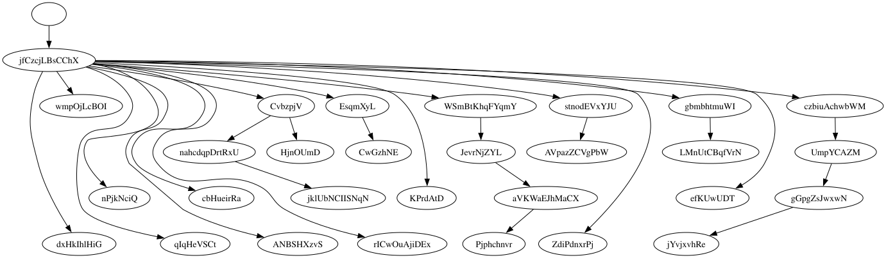
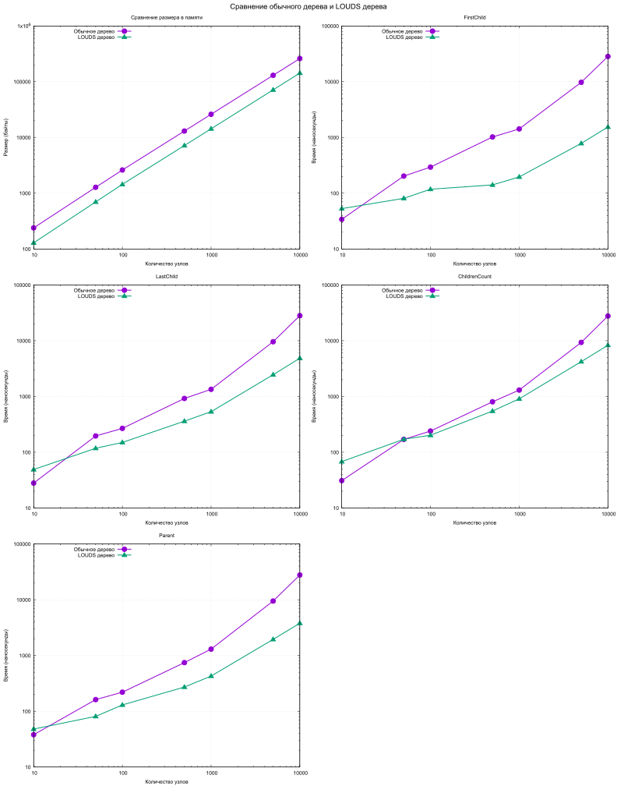

# LOUDS

A tree of pointers spends most of its memory on the pointers. A succinct structure stores
the same shape in close to the information-theoretic minimum and answers the same questions
by computing over that encoding instead of following links. This study implements one such
structure, LOUDS, and measures what it saves and what it costs.

## The idea

LOUDS encodes the shape of a tree as a single bit sequence. Nodes are numbered in
breadth-first order, and each node with `k` children contributes `k` ones followed by a
zero. Navigation then becomes two operations over that sequence, `Rank(i, bit)` counting the
occurrences of a bit before a position and `Select(n, bit)` finding the position of the
n-th occurrence. The implementation here keeps an inverted index from a node's value to its
index, so that finding a node does not require a scan.



*Figure 1. A tree produced by the generator, laid out level by level, which is the order
LOUDS numbers it in.*

The trade-off is stated plainly by the structure itself. Storage is compact and access is
sequential, which suits a cache, but navigation has to be computed rather than followed, and
a naive `Rank` and `Select` are linear where an optimised implementation reaches constant
and near-constant time.

## Method

Both a classical pointer tree and a LOUDS tree are built in Go over sizes from ten to ten
thousand nodes. Memory is measured for each, and four navigation operations are timed, each
repeated ten thousand times and averaged.

## Results

| Nodes | Pointer tree, bytes | LOUDS, bytes |
|------:|--------------------:|-------------:|
| 10 | 239 | 129 |
| 100 | 2611 | 1444 |
| 1000 | 26059 | 14317 |
| 10000 | 260344 | 142852 |

| Operation on 10 000 nodes | Pointer tree, ns | LOUDS, ns |
|---------------------------|-----------------:|----------:|
| FirstChild | 28360 | 1543 |
| Parent | 27782 | 3795 |
| LastChild | 28152 | 4857 |
| ChildrenCount | 27737 | 8309 |



*Figure 2. Memory and the four operations against the number of nodes, every axis
logarithmic, pointer tree in violet against LOUDS in green. On each operation the two lines
cross below a hundred nodes and diverge from there.*

## What the numbers say

The same tree fits in about 45 per cent less memory, and the saving holds at that fraction
across every size, which is what a structure with no pointers should give against one that is
mostly pointers.

On the smallest tree the pointer version is faster, since following a pointer beats scanning
a bit sequence when there is almost nothing to scan. The curves cross below a hundred nodes,
and by ten thousand LOUDS leads on all four operations, by 18.4 times on `FirstChild`, 7.3 on
`Parent`, 5.8 on `LastChild` and 3.3 on `ChildrenCount`.

The reason is not the asymptotics, which favour the pointer tree if anything, but the memory.
A compact bit array is read sequentially and stays in cache, while a pointer tree of ten
thousand nodes scatters them across the heap and pays a miss at every step.

## Running

```bash
make
```
